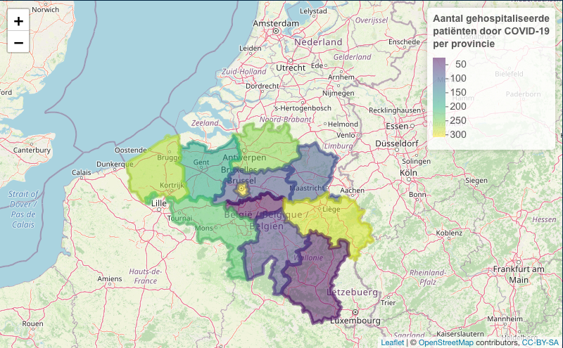

```{r setup, include=FALSE}
knitr::opts_chunk$set(echo = TRUE)
```

## GIS analyses met R



## Packages
```{r}
library(readr)
library(dplyr)
library(sf)
library(leaflet)
```

## Data manipulatie

```{r}
covid  <- read_csv("https://epistat.sciensano.be/Data/COVID19BE_HOSP.csv")
provincies <- readRDS(url("https://biogeo.ucdavis.edu/data/gadm3.6/Rsf/gadm36_BEL_2_sf.rds"))
```

### COVID-data bekijken
```{r}
glimpse(covid)
```

### Provincie-data bekijken
```{r}
glimpse(provincies)
```

### Meest recente COVID-data uitfilteren
```{r}
covid <- covid %>%
  group_by(PROVINCE) %>%
  filter(DATE == max(DATE, na.rm=TRUE))
```

### Kolommen selecteren in COVID-data

```{r}
covid <- covid %>%
   select(PROVINCE, TOTAL_IN)
```

### Vergelijken van provincie-namen in COVID -en provincie-data

```{r}
sort(unique(covid %>% pull(PROVINCE)))

sort(unique(provincies %>% pull(NAME_2)))
```

### Provincies bewerken
```{r}
provincies <- provincies %>%
  mutate(NAME_2=recode(NAME_2, Bruxelles="Brussels", `West-Vlaanderen`="WestVlaanderen", `Oost-Vlaanderen`="OostVlaanderen", `Brabant Wallon`="BrabantWallon", `Vlaams Brabant`="VlaamsBrabant"))
```

### Checken of alles identiek is

```{r}
identical(sort(unique(covid %>% pull(PROVINCE))),sort(unique(provincies %>% pull(NAME_2))))
```


### Data aan elkaar verbinden

```{r}
resultaat <- provincies %>%
  left_join(covid, by=c("NAME_2"="PROVINCE"))
```

## Kaartje maken
```{r}
leaflet(resultaat) %>%
  addTiles() %>%
  addPolygons()
```


### Kleurenpallet
```{r}
pal <- colorNumeric(
  palette = "viridis",
  domain = resultaat$TOTAL_IN)
```

### Kleurenpallet op kaartje zetten
```{r}
leaflet(resultaat) %>%
  addTiles() %>%
  addPolygons(color =  ~pal(TOTAL_IN), fillOpacity = 0.5)
```

### Legende toevoegen
```{r}
leaflet(resultaat) %>%
  addTiles() %>%
  addPolygons(color =  ~pal(TOTAL_IN), fillOpacity = 0.5) %>%
  addLegend(pal = pal, values = ~TOTAL_IN)
```

### Titel toevoegen
```{r}
leaflet(resultaat) %>%
  addTiles() %>%
  addPolygons(color =  ~pal(TOTAL_IN), fillOpacity = 0.5) %>%
  addLegend(pal = pal, values = ~TOTAL_IN, title = "Aantal gehospitaliseerde<br>patiënten door COVID-19<br> per provincie")
```


