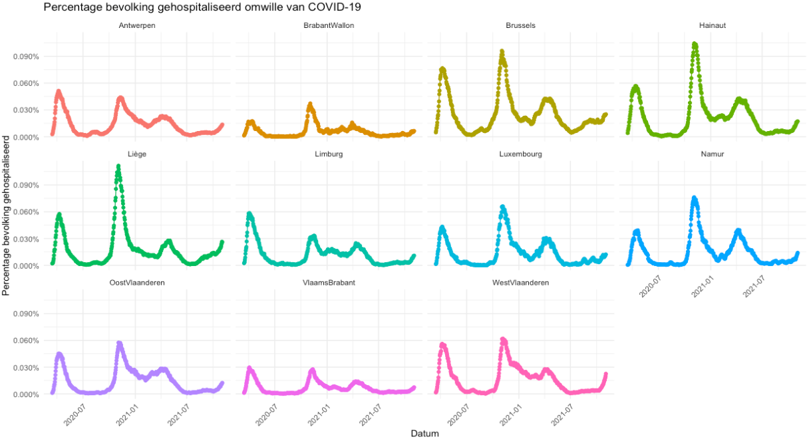

```{r setup, include=FALSE}
knitr::opts_chunk$set(echo = TRUE)
library(readr)
library(dplyr)
library(readxl)
covid  <- read_csv("https://epistat.sciensano.be/Data/COVID19BE_HOSP.csv")
bevolking_bestand <- tempfile()

download.file(url = "https://statbel.fgov.be/sites/default/files/files/opendata/bevolking%20naar%20woonplaats%2C%20nationaliteit%20burgelijke%20staat%20%2C%20leeftijd%20en%20geslacht/TF_SOC_POP_STRUCT_2021.xlsx", destfile = bevolking_bestand)
bevolking <- read_excel(bevolking_bestand)
bevolking <- bevolking %>%
  group_by(TX_PROV_DESCR_NL) %>%
  summarise(MS_POPULATION=sum(MS_POPULATION, na.rm=TRUE))

bevolking <- bevolking %>%
  mutate(TX_PROV_DESCR_NL=gsub("Provincie ", "", TX_PROV_DESCR_NL)) %>%
  mutate(TX_PROV_DESCR_NL=recode(TX_PROV_DESCR_NL, Henegouwen="Hainaut", Luxemburg="Luxembourg", `West-Vlaanderen`="WestVlaanderen", `Oost-Vlaanderen`="OostVlaanderen", `Waals-Brabant`="BrabantWallon", `Vlaams-Brabant`="VlaamsBrabant", "Luik"="Liège", "Namen"="Namur"))

bevolking <- bevolking %>%
            mutate(TX_PROV_DESCR_NL=ifelse(is.na(TX_PROV_DESCR_NL), "Brussels", TX_PROV_DESCR_NL))

covid <- covid %>%
   select(DATE, PROVINCE, TOTAL_IN)

covid <- covid %>%
   left_join(bevolking, by=c("PROVINCE"="TX_PROV_DESCR_NL"))


covid <- covid %>%
   mutate(`Percentage bevolking gehospitaliseerd`=TOTAL_IN/MS_POPULATION)
```

# Data visualisatie met ggplot2



## Packages

```{r}
library(ggplot2)
library(scales)
library(dplyr)
```


## Data

```{r}
glimpse(covid)
```

## Plot opbouwen

### Plot canvas
```{r}
ggplot(data=covid)
```


### aes() mapping
```{r}
ggplot(data=covid, mapping = aes(x=DATE, y=`Percentage bevolking gehospitaliseerd`, fill=PROVINCE, color=PROVINCE))
```


### Geometry lagen: punten

```{r}
ggplot(data=covid, mapping = aes(x=DATE, y=`Percentage bevolking gehospitaliseerd`, fill=PROVINCE, color=PROVINCE)) +
  geom_point()
```

### Geometry lagen: lijnen
```{r}
ggplot(data=covid, mapping = aes(x=DATE, y=`Percentage bevolking gehospitaliseerd`, fill=PROVINCE, color=PROVINCE)) +
  geom_point() +
  geom_line()
```

### Wrapping

```{r}
ggplot(data=covid, mapping = aes(x=DATE, y=`Percentage bevolking gehospitaliseerd`, fill=PROVINCE, color=PROVINCE)) +
  geom_point() +
  geom_line() +
  facet_wrap(~PROVINCE)
```

### Theming (1)

```{r}
ggplot(data=covid, mapping = aes(x=DATE, y=`Percentage bevolking gehospitaliseerd`, fill=PROVINCE, color=PROVINCE)) +
  geom_point() +
  geom_line() +
  facet_wrap(~PROVINCE) +
  theme_minimal()
```

### Theming (2)

```{r}
ggplot(data=covid, mapping = aes(x=DATE, y=`Percentage bevolking gehospitaliseerd`, fill=PROVINCE, color=PROVINCE)) +
  geom_point() +
  geom_line() +
  facet_wrap(~PROVINCE) +
  theme_minimal() +
  theme(legend.position="none")
```

### Theming (3)

```{r}
ggplot(data=covid, mapping = aes(x=DATE, y=`Percentage bevolking gehospitaliseerd`, fill=PROVINCE, color=PROVINCE)) +
  geom_point() +
  geom_line() +
  facet_wrap(~PROVINCE) +
  theme_minimal() +
  theme(legend.position="none",
        axis.text.x = element_text(angle = 45, hjust = 1)
        )
```

### Y-as als percentage formatteren

```{r}
ggplot(data=covid, mapping = aes(x=DATE, y=`Percentage bevolking gehospitaliseerd`, fill=PROVINCE, color=PROVINCE)) +
  geom_point() +
  geom_line() +
  scale_y_continuous(labels=percent) +
  facet_wrap(~PROVINCE) +
  theme_minimal() +
  theme(legend.position="none",
        axis.text.x = element_text(angle = 45, hjust = 1)
        )
```

### Titels

```{r}
ggplot(data=covid, mapping = aes(x=DATE, y=`Percentage bevolking gehospitaliseerd`, fill=PROVINCE, color=PROVINCE)) +
  geom_point() +
  geom_line() +
  scale_y_continuous(labels=percent) +
  facet_wrap(~PROVINCE) +
  theme_minimal() +
  theme(legend.position="none",
        axis.text.x = element_text(angle = 45, hjust = 1)
        ) +
  labs(x="Datum", title="Percentage bevolking gehospitaliseerd omwille van COVID-19")
```

