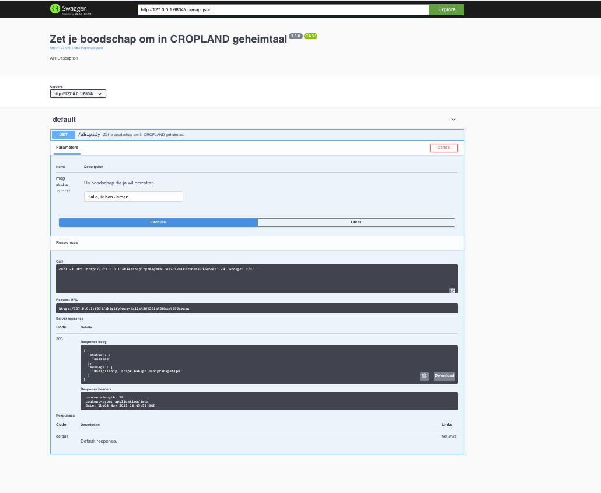

```{r setup, include=FALSE}
knitr::opts_chunk$set(echo = TRUE)
```

## Plumber api
Welkom op het video kanaal van CROPLAND. Mijn naam is Jeroen Claes en ik ben een data scientist bij CROPLAND. In deze video ga ik je tonen hoe je eenvoudig zelf een API kan bouwen met R. Concreet gaan we deze API bouwen die een boodschap omzet in CROPLAND geheimtaal, een woordspelletje dat erin bestaat om elke klinker te vervangen door "ahip".



## Packages
Voor we beginnen, laten we eerst even een aantal R packages inladen die we nodig gaan hebben. We beginnen met het stringi pakket, het meest gebruikte pakket om tekst te bewerken.
```{r}
library(stringi)
```

## Functie
Laten we beginnen met de functie te maken die de boodschappen omzet in onze geheimtaal. Het principe hierachter is vrij eenvoudig. Elke klinker laten we voorafgaan door "ehp". Dit kunnen we vrij eenvoudig implementeren met een reguliere expressie en de stringi-functie stri_replace_all_regex. Wanneer we ahipfy() proberen met als input "dag ik ben jeroen", dan zien we dat dit absoluut onbegrijpelijk geworden is

```{r }

ahipify <- function(x) {
  stri_replace_all_regex(x, "[aeiou]", "ahip")
  
}

```

# API maken
Om deze functie nu ter beschikking te stellen als een API moeten we een nieuwe R file aan maken. We doen dus File > New File >Plumber API in RStudio. 

Dit maakt een nieuwe file aan, waarin al een template API instaat. 

Het eerste wat we gaan doen, is onder library(plumber), library(stringi) toevoegen. Daarna gaan we ook onze functie-definitie kopiëren naar deze file. 

Zoals je kan zien, is een plumber api file eigenlijk een gewoon R script, met een aantal speciale commentaren en functies. 

Wanneer van boven naar onder scrollen door deze file zien we een eerste speciale commentaar, apiTitle. Deze laat ons toe om een titel in te stellen voor onze API. Laten we hier "Ahipify" van maken.

De lijn daaronder geeft wat beschrijvende tekst voor het eerste eindpunt. We gaan dit wijzigen in "Zet je boodschap om in CROPLAND geheimtaal".  Met @param kan je de inputs van dit eindpunt beschrijven. We behouden msg, maar we veranderen de beschrijving in "De boodschap die je wil omzetten". Let erop dat de naam van deze parameter moet overeenkomen met de naam van een van de argumenten in de functie die je hieronder definieert. 

De volgende lijn beschrijft de HTTP methode die we willen gebruiken voor ons API eindpunt. @get bepaalt dat dit de GET methode is. De backslash en de tekst na @get bepaalt dat dit eindpunt beschikbaar is op /echo. Laten we dit veranderen naar /ahipify. 

Op de volgende lijn begint de functie die het eigenlijke werk zal uitvoeren dat in het eindpunt gebeurt. We verwijderen deze functie en we vervangen die door. 

```{r}
function(msg="") {
  return(list(status="success", message=ahipify(msg)))
  
}


```


Als je nu op opslaan klikt en rechts bovenaan op "Run API", dan is je API up and running!


